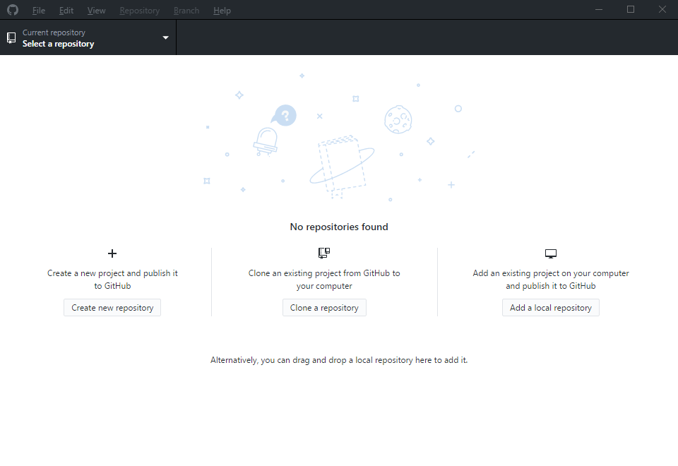
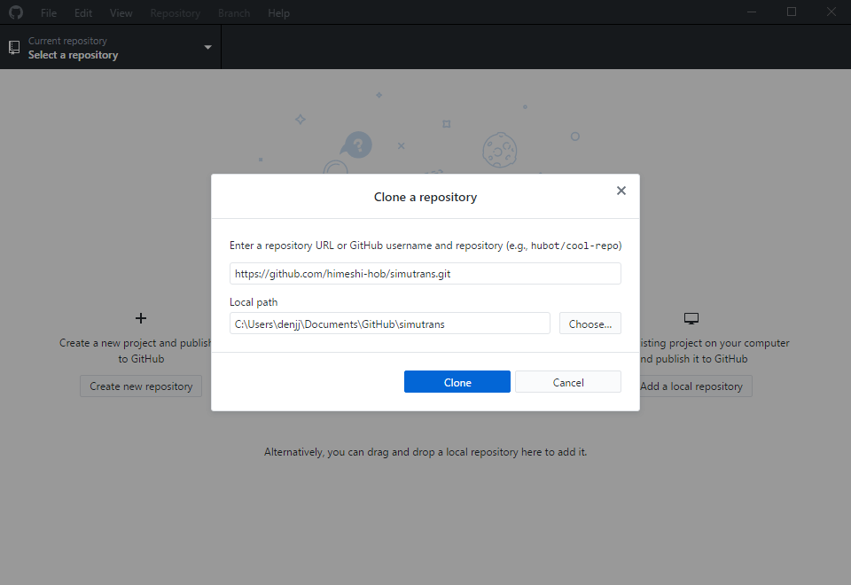
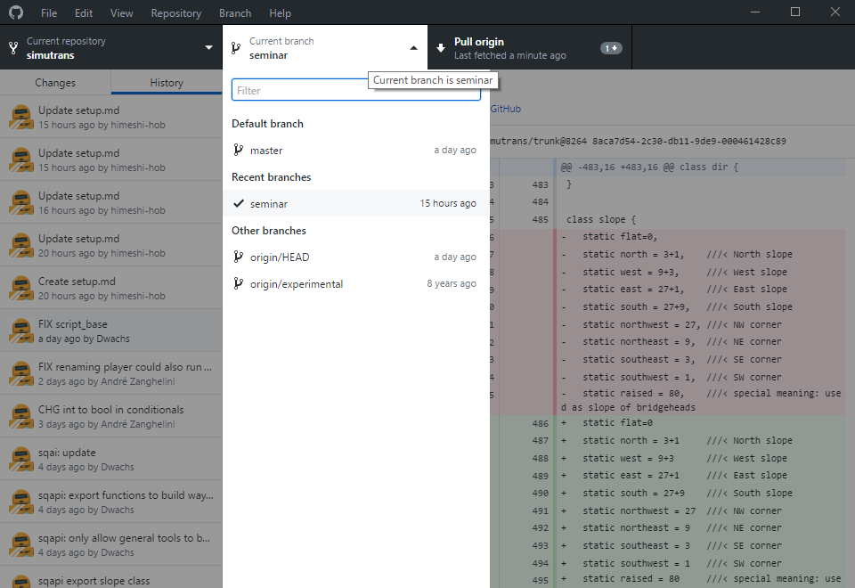

# Simutrans 開発セットアップ
検証したら全然うまくいかないので書き直し中orz  

## gitの整備
gitを使って開発を進めます。  
（以下わかる人向けの説明）  
GitHubのhimeshi-hob/simutransリポジトリの然るべきブランチ（「seminar」ブランチがmasterだと思ってください。masterブランチは本家との同期用です。ブランチは勝手にバシバシ作っていただいて構いません。）に直接コミット・プッシュしてもらいます。このリポジトリのCollaboratorになってもらってご自分のアカウントからアクセスしていただきます。twitterの@himeshi_hobにDMか何かでGitHubアカウントを教えていただいたら登録しますのであとはご自分の慣れ親しんだ環境で開発してください。  
（わかる人向けの説明終わり）

### gitクライアントのインストール
まずは（お持ちでない方は）GitHubのアカウントを作りましょう。すでにお持ちの方は新しく作る必要はありません.  
後で説明しますが、共同開発のためにアカウントをCollaboratorに登録する必要があるのでtwitter @himeshi_hobにDMか何かでアカウントのユーザー名を教えてください.  
クライアントとしてGitHub Desktopを使用します。https://desktop.github.com/ から「Download for Windows」を選択してダウンロードしてください.  
インストーラーを立ち上げたら「Sign into GitHub.com」でログインしてください。あとは指示に従ってインストールを完了してください.  
インストールが完了するとGitHub Desktopが起動して図1のような画面が表示されるはずです.  
  
「Clone a repository」ボタンを選択すると図2のような画面が表示されるので「https://github.com/himeshi-hob/simutrans.git 」と入力してCloneしてください。これでローカルにSimutransの最新nightlyコードがコピーされます.  
  
Gitの基本的な概念はこちらのサイトにわかりやすくまとまっています。 http://www.backlog.jp/git-guide/stepup/stepup1_1.html  
GitHub Desktopを入れたのでコミットやプッシュ、ブランチの切り替えなどが一切コマンドを打たずに実行できます.  
Branchの構成は図3のようになっています。「Seminar」ブランチがマスターブランチだと思ってください。作業をするときはSeminarブランチを親にして自分でブランチを切って作業してください。ブランチは勝手にバシバシ切ってもらって構いません.  
  

## コンパイル方法
(参考：http://japanese.simutrans.com/index.php?%B3%AB%C8%AF%2F%A5%D3%A5%EB%A5%C9%CA%FD%CB%A1 )←ここに従うのが一番良いかも。  
1. MinGWをインストールする。（http://mingw.org/download/installer ）  
MinGW Installation Managerが起動するので左側タブ「Basic Setup」を選択し、右側から「mingw32-base」「mingw32-gcc-g++」を右クリックで選択。「Mark for Installation」を選び、画面上部のタブから「Installation」→「Apply Changes」→「Apply」でインストールする。
2. http://sourceforge.net/project/showfiles.php?group_id=2435 からbzip2-1.0.5-2-mingw32-dev.tar.gzとlibz-1.2.3-1-mingw32-dev.tar.gzをダウンロードする。  
リンク先から「MinGW」,「Extension」,「zlibもしくはbzip2」の順にフォルダを開けていけばたどり着ける。  
ダウンロードしたファイルをTGZ形式を解凍できるツールで解凍して、中のincludeとlibをMinGWのインストール先(デフォルトではC:\MinGW")に上書きコピーする。（二重圧縮されている。）  
http://libunicows.sourceforge.net/ からlibunicows-1.1.1-mingw32.zipをダウンロードして、 libunicows.aをMinGWのインストール先のlib内にコピー。
1. msys2をインストール。（ http://www.msys2.org/ ）原則としてx86_64とついてるやつをインストールしましょう。
2. msys2を起動し（64bit版を起動する） `pacman -Syuu` を実行する。  
「msysを閉じろ」というメッセージが出てくるので一度閉じるボタンで閉じてmsys2をもう一度起動する。その後もう一度`pacman -Syuu` を実行する。  
アップデート対象がなくなるまで`pacman -Syuu`を繰り返し実行する。  
（コレでmsys2のいろいろがアプデされる。）  
3. 以下のコマンドを順に実行する。  
`pacman -S make`  
`pacman -S gcc`  
`pacman -S mingw-w64-i686-libpng`  
`pacman -S mingw-w64-i686-pkg-config`  
今回はいらないがSDL版を作りたい時は以下も追加で実行する。   
`pacman -S SDL`  
`pacman -S SDL2`   

4. msys2の**32bit版**を起動し、cdコマンドでソースコードのフォルダに移動する。  
例：ソースコードのフォルダがC:\users\himeshi\desktop\simutrans である場合  
`cd C:`  
`cd users/himeshi/desktop/simutrans`  
(msys2ではCドライブは外付けドライブとして認識されるらしい。)  
5. config.defaultを作る。以下の記述をエディタにコピペし、ソースコードフォルダ（のトップディレクトリ）に「config.default」という名前で保存する。  

    BACKEND = gdi #どのライブラリ  
    COLOUR_DEPTH =16#このまま使う  
    OSTYPE = mingw #winはmingwです  
    DEBUG = 3 #ログをたくさん出す  
    WITH_REVISION = 8128 #バージョン。とりあえずテキトーでよい。  
    WIN32_CONSOLE = 1  
    #winでコマンドプロンプトを出す  
    MULTI_THREAD = 1 #マルチスレッドON  
    STATIC = 1 #Windowsでのみ書く  
    #以下はよくわからないおまじない  
    MAKEOBJ_PROGDIR = $(shell pwd)  
    NETTOOL_PROGDIR = $(shell pwd)  
    PROGDIR  = $(shell pwd)  
    
6. コマンド`make -j4` を実行（-j4で4並列でコンパイルしてくれる。）
7. 「sim.exe」が生成されるのでpakとかいろいろ入ってるフォルダにつっこんで起動してみましょう。

## デバッガを使おう
sim.exeをそのまま起動すると例えばNullPointer Access等でプログラムが停止した時「プログラムが動作を停止しました」としか出てこなくてわけがわかりません。しかしgdbというデバッガを経由して起動してあげると「どこが悪いのか」や「どうしてソレが悪いのか」「その時の変数がどうなっているか」が一瞬でわかります。
hoge
